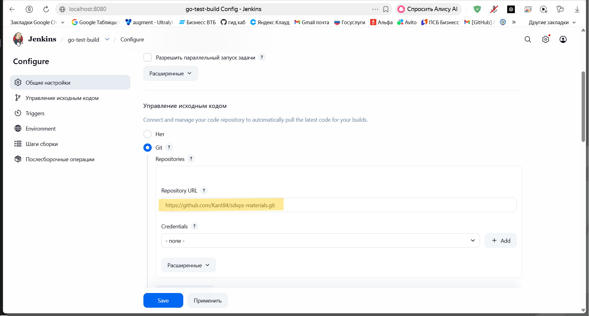
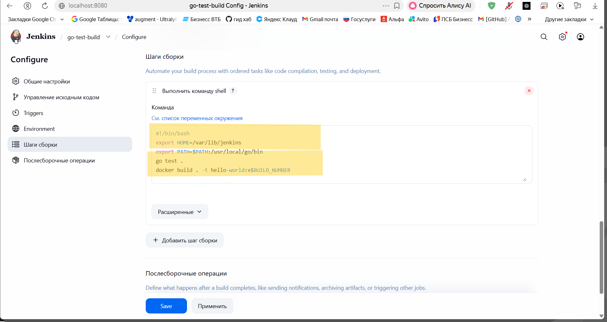
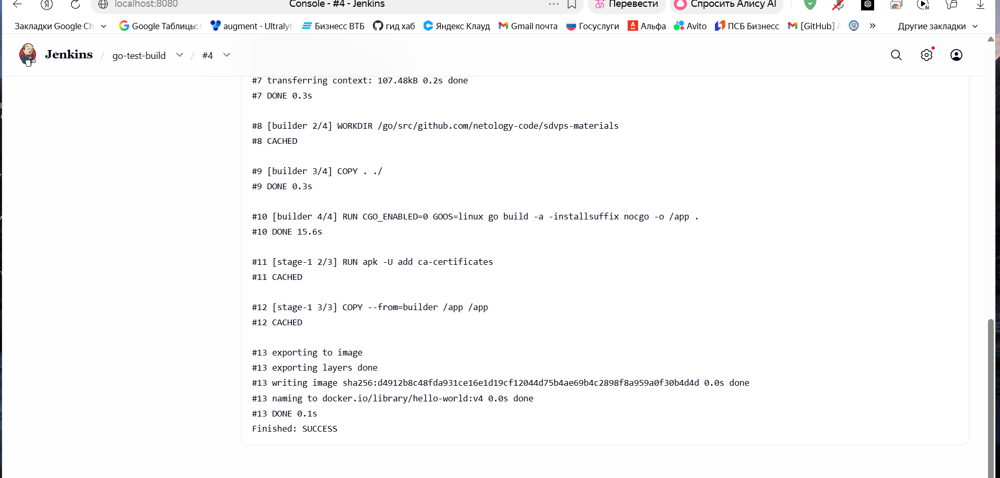
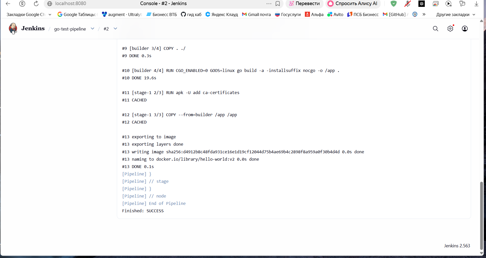
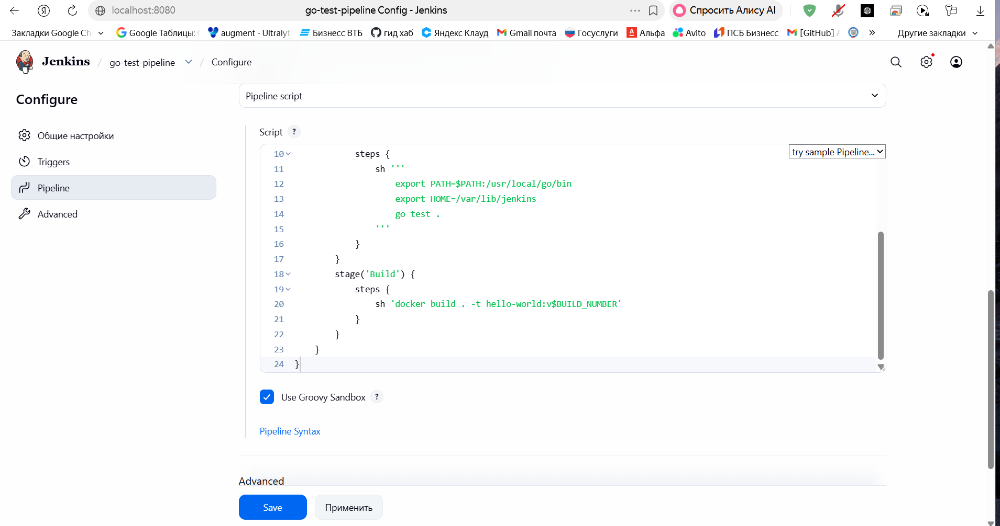
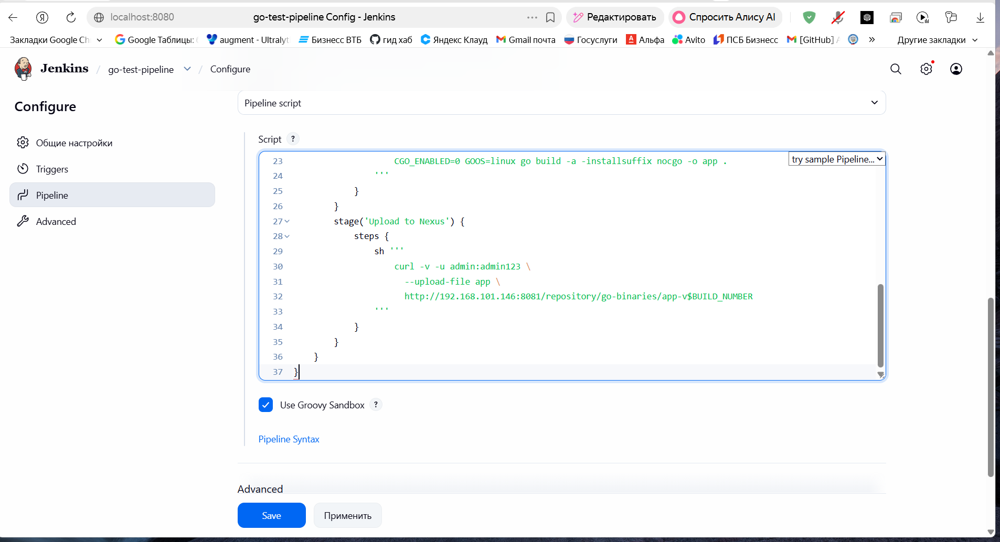
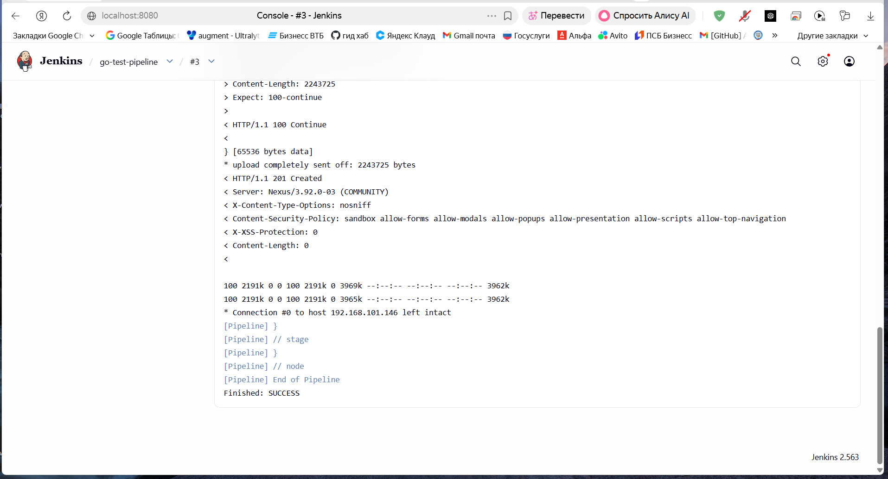
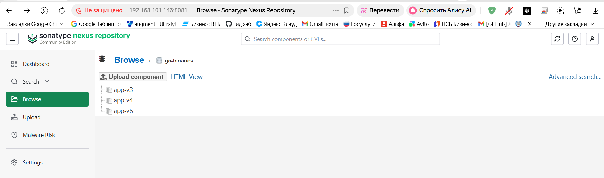

# Домашнее задание «Что такое DevOps. CI/CD»
## Автор: Андрей Санакин

## Задание 1: Freestyle Project

**Настройки Git:**

**Build Steps:**

**Результат сборки:**

## Задание 2: Pipeline

**Stage View:**

**Console Output:**

## Задание 3: Nexus + бинарный файл

**Репозиторий Nexus:**

**Загрузка в Nexus:**

## Задание 4*: Версионирование

**Несколько версий в Nexus:**

